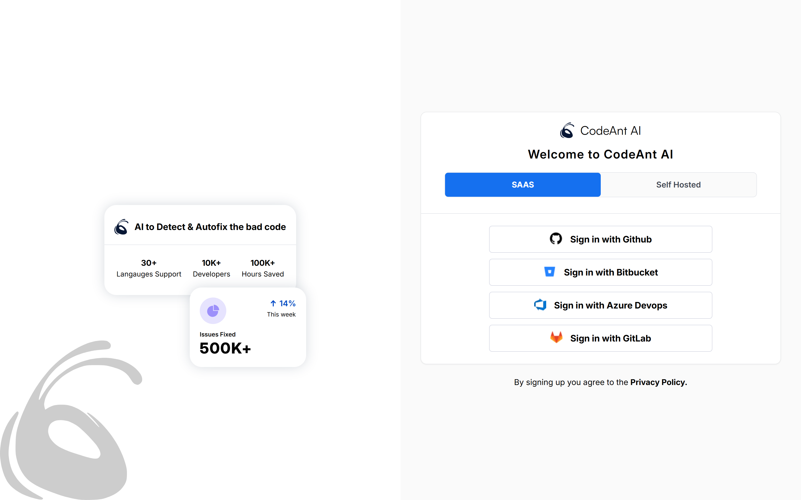
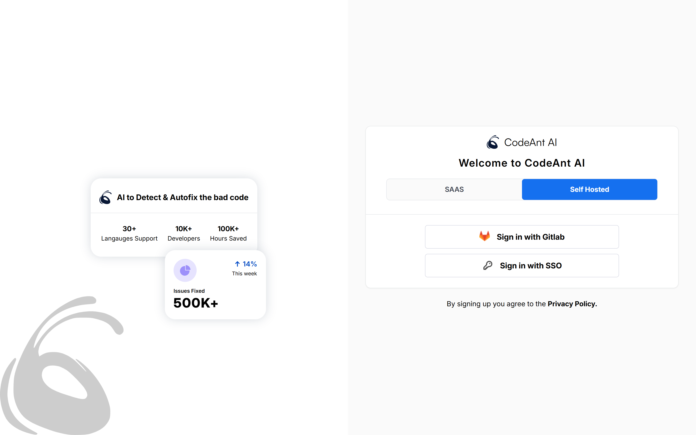
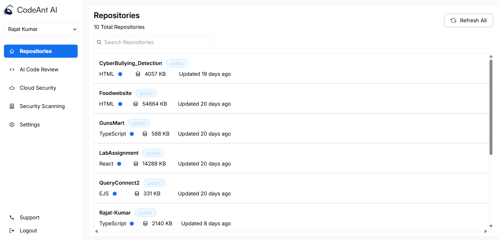

# CodeAnt AI - RepoTracker 💻

CodeAnt AI RepoTracker is a cutting-edge web application developed using React that enables developers to effectively oversee and evaluate their GitHub repositories. It offers a user-friendly platform for repository organization, code insights, and team collaboration.

### Live Demo
✨ [Check out CodeAnt AI RepoTracker](https://code-ant-ai-repo-tracker.vercel.app/)

## Features

- **Effortless Authentication**

- Supports both SAAS and self-hosted environments
- Ensures secure user sessions
- Designed with a focus on privacy

- **Efficient Repository Management**

- Instantly search and filter repositories
- Rapid repository updates
- Visual representation of repository metrics
- User-friendly repository overview

- **Contemporary UI/UX**

- Sleek and adaptive design
- Optimized for mobile usage

## Tech Stack

- **Frontend Library**: React JS
- **Navigation**: React Router DOM
- **Styling Solutions**:
 Tailwind CSS
 Radix UI Elements
- **Data Source**: GitHub API


## Run Locally

Clone the project

```bash
  git clone https://github.com/Rajat4323/CodeAnt-AI-RepoTracker.git
```

Go to the project directory

```bash
  cd Repotracker
```

Install dependencies

```bash
  npm i
```

Start the server

```bash
  npm run dev
```

Open the application in browser:

```bash
  http://localhost:5173
```

## Project Structure

```
codeant-ai-repotracker/
├── src/
│   ├── components/
│   │   ├── AuthForm.jsx
│   │   ├── AuthPlaceholder.jsx
│   │   ├── Authentication.jsx
│   │   └── Sidebar.jsx
│   ├── pages/
│   │   ├── Auth.jsx
│   │   ├── Home.jsx
│   │   └── NotFound.jsx
│   ├── App.jsx
│   └── main.jsx
├── public/
│   ├── icons/
│   └── output/
├── config/
│   ├── components.json
│   ├── tailwind.config.js
│   └── vite.config.js
└── package.json
```
## 📷 Application Screenshots

### User Authentication
###  1. SAAS Login


### 2. Self-Hosted Login


### Main Dashboard




### 🤝 Connect with me:

Feel free to connect with me 
rajatkumar020304@gmail.com
